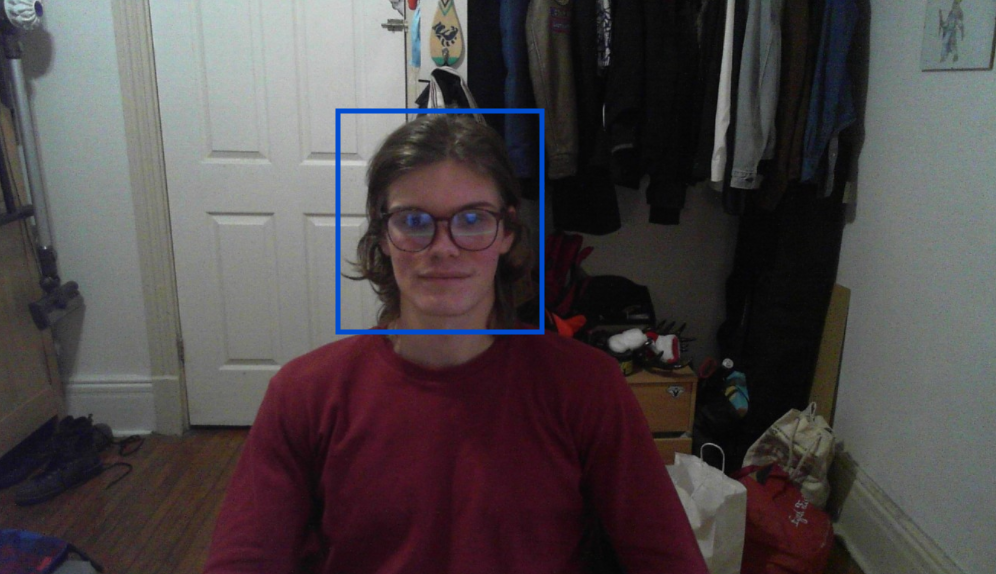
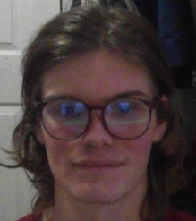
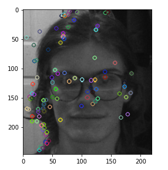
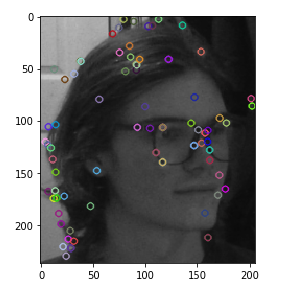
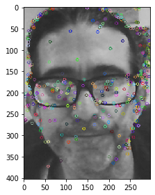
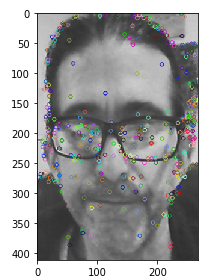

# ELEC 474 Final Project
**Due December 8 2020**

Matthieu Roux - 20013052

Harry Chan - 20022216

--- 

## Declaration of Originality

We declare that we (Harry Chan and Matthieu Roux) are sole authors of the submitted solution. The code was developed over a shared repository and done in using pair programming methods over video call.

---

## Method used

As indicated in the project hints, a sheet of paper is a planar surface, while a face is not. As a general hypothesis fake (printed) faces will generate more matching points than a real face because of the shared similarities on the same plane. This means that it is possible to do a decent feature matching between the images triplets that use fake faces, while the feature matching between the real faces will not work as well. Using this information will be able to set a generate threshold to evaluate if the new test images fall under the fake faces category or the real face category.

It is also important to mention that due to the amount of noise that surrounds the object of focus (in this project's case, the face) the use of several OpenCV's Haar Cascade classifiers were used. Narrowing down the picture to just the object of interest will eliminate any of the matching points that are not relevant. However there were.

| Original Image                                | Face Detection                              |
| --------------------------------------------- | ------------------------------------------- |
|  |  |

In order for this to work properly we need to run the feature matching on faces only which requires some face detection method.

Our Training and Testing steps can be seen below

### Training

1. Import 70% (Adjustable) of images by triplets of frontal, left profile and right profile respectively
2. Detect and crop faces in each triplets by using OpenCV's Haar Cascade classifiers as mentioned above
3. Select the two best faces in the triplets and perform feature matching and store the number of matches
4. repeat this process for all fake and real images
5. Declare a **match threshold** that is exactly between the highest number of matches in a real images, and the lowest amount of matches in a fake one

### Testing
1. Import the remaining 30% of remaining images and add our own and put them in triplets of frontal, left profile and right profile respectively
2. Detect and crop faces in each triplet by using OpenCV's Haar Cascade classifiers as mentioned above
3. Select the two best faces in the triplets and perform feature matching and store the number of matches
4. Compare the number of matches with the **match threshold**: if there are **less matches** than in the threshold, the face is **real** if there are **more matches** than the threshold then the face is **fake**.

## Implementation

### Organizing the data

We decided to leave around 30% of the data provided to us for testing our results, leaving 70% for training. The reason 30% was chosen is because it's a standard amount in testing sets. 

These numbers are highly adjustable as it is set as a variable in the import function that is provided. All images were imported as a list of triplets, a triplet being a set of 3 images: the center one then its corresponding left and right image. This made it a lot easier for us to manipulate the data and ensure triplets would not get mixed up

### Face Detection

The face detection was done using the OpenCV `CascadeClassifier`. Unfortunately there was no classifier model that would detect every face. To overcome this we made use of several different haar classifier models such as the `frontalface_alt`, `frontalface_default`, `frontalface_alt2`, and `profileface` increased the possibility of a correct identification. 

There several instances in which the face detection misidentified a face in one of the images.
Misidentified faces always had a very small image size so taking the largest two images of the three that were given helped increase the matching as well.

### Match Detection

If the face detection could only detect 2 faces. matching would occur on those. If there were 3 images, the matching would happen on the two larger images.
Match detection was done by detecting keypoints using SIFT and matching them using a Flann based matcher. We used the OpenCV's `cv2.SIFT_create()`, `detectAndCompute` methods and the `cv2.FlannBasedMatcher().knnMatch` to obtain the pairs of bet matches for the two images on which matching was performed. Lowe's filtering was used to filter out poor matches. Finally the total number of matches was returned.

There are significantly more points that are matched after these processes were run on the respective images below. The average amount of points that generated a match on both the real image and the fake images came to be 27.375 and 166.75 respectively. Depending on the training data this number will vary slightly. However it is important to note that the threshold generated from this specific training data came out to be around 85 matches for an image to be classified as a fake face.

|              Real Face Frontal               |               Real Face Right               |
| :------------------------------------------: | :-----------------------------------------: |
|  |  |

|              Fake Face Frontal               |               Face Face Left                |
| :------------------------------------------: | :-----------------------------------------: |
|  |  |

## Tests

Tests were performed on the 30% remaining data + our own faces. We created an evaluation matrix to compare results.

### Confusion Matrix

|                  | Predicted Positives | Predicted Negatives |
| :--------------- | :-----------------: | :-----------------: |
| Actual Positives |          4          |          4          |
| Actual Negatives |          0          |          0          |

**Precision** = 100%

**Recall** = 100%

**Training Time** = ~ 1 second per image triplet

**Testing Time** = ~1 second per image triplet

## Conclusion

Our system was very successful at predicting the provided data set and our own faces. It does have its flaws however and relies on some assumptions.

The solution is quite effective on tests that use faces on paper and that don't fold that paper, or wear a mask. If an imposter was to wrap the paper around their face, our solution would not work. Problems of this scope could perhaps be solved using a lidar add on.
Our solution is also unable to detect photoshopped faces.

We have not run into any computationally expensive processes because we used OpenCV's optimized libraries and used the python performance oriented practices (such as list comprehensions) to make sure our code runs smoothly.

If we had more time we are unsure on how we would improve the solution with the same restricted dataset, library and camera restrictions.

As previously mentioned, using a lidar camera would allow us to detect very effectively unusual 3D geometry like a sheet of paper in front of the face. With enough data we would have been able to train lidar data as to what an average face looks like, and to train a neural network to identify if the person is wearing a mask or not.
